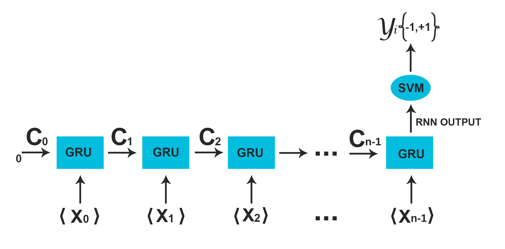

## The Proposed GRU-SVM Model

Similar to the work done by <a href="http://ieeexplore.ieee.org/abstract/document/6544391/">Alalshekmubarak & Smith (2013)</a>, the present study proposes to use SVM as the classification function in an RNN. The difference being instead of ESN, the RNN class to be used in the study is the GRU model (see <a href='figures/gru.png'>Figure 4</a>).

Figure 4: Image from [Chris Olah's Blog](http://colah.github.io/posts/2015-08-Understanding-LSTMs/). The GRU model combines the "forget" gate and "input" gate into a single "update" gate, making it simpler than the LSTM model (see [LSTM model](figures/rnn-lstm.png)).

Figure 5: The proposed GRU-SVM neural network architecture, implemented using [TensorFlow](http://tensorflow.org/).

The proposed GRU-SVM model shall be compared with the conventional GRU-Softmax model, for intrusion detection in [network traffic data from Kyoto University's honeypot systems](http://www.takakura.com/Kyoto_data/).

An [initial experiment](https://github.com/AFAgarap/gru-svm/tree/master/results/initial) has been conducted to show the difference between the two models: a validated accuracy for the GRU-SVM model of 80.53%, and a validated accuracy for the GRU-Softmax model of 71.41%. Note that these results were done with hyper-parameters that may be posited as sub-optimal for the both models.